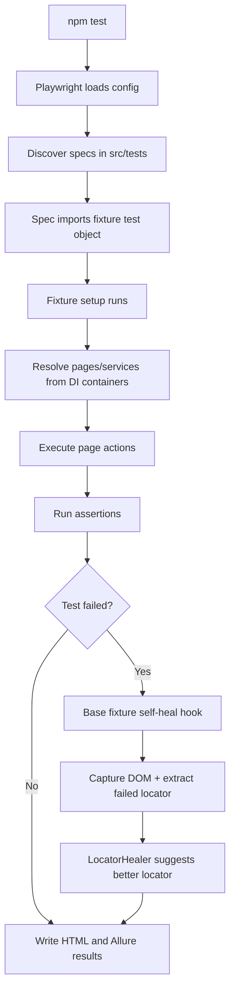
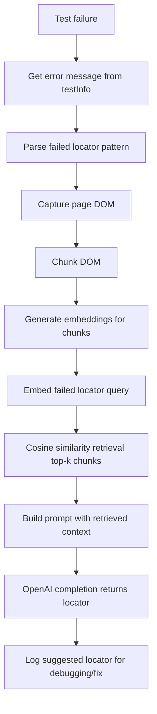
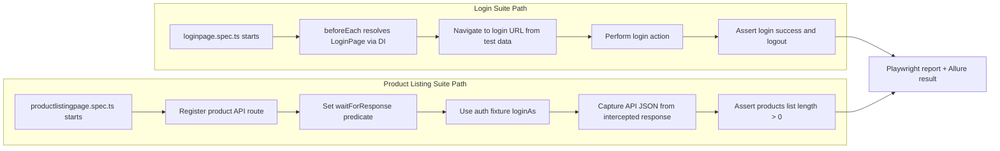

# Playwright Automation Framework

Scalable test automation framework built with Playwright + TypeScript, using Inversify for dependency injection, fixture layering for reusable test setup, and AI-assisted self-healing for locator failures.

## Highlights

- Layered framework: `tests` -> `pages` -> `pageObjects`.
- Reusable custom fixtures (`base` and `auth`).
- Inversify DI for page/service wiring.
- Data-driven tests from JSON files.
- API interception support for validating backend responses.
- RAG-style AI locator suggestion on failed tests.
- HTML and Allure reports.
- ESLint rule enforcing consistent imports (no `src/...` absolute imports).

## Tech Stack

- Playwright
- TypeScript
- Inversify
- OpenAI SDK
- LangChain and ChromaDB (available for RAG evolution)
- Allure reporter
- ESLint

## Project Structure

```text
Playwright_Framework/
├── src/
│   ├── containers/              # DI containers and symbols
│   │   ├── ai/
│   │   ├── homepage/
│   │   ├── loginpage/
│   │   └── productlistingpage/
│   ├── interfaces/              # Contracts for pages/services
│   │   ├── ai/
│   │   └── pages/
│   ├── models/                  # Shared data models
│   ├── pageObjects/             # Locator-only classes
│   ├── pages/                   # Business/page actions
│   ├── resource/                # Test data and API test data
│   │   ├── testdata/
│   │   └── api_testdata/
│   ├── services/                # Concrete service implementations
│   ├── tests/
│   │   ├── fixtures/            # Shared fixture layers
│   │   │   ├── base.fixture.ts
│   │   │   └── auth.fixture.ts
│   │   ├── launchBrowser.spec.ts
│   │   ├── loginpage.spec.ts
│   │   └── productlistingpage.spec.ts
│   └── utils/
├── ARCHITECTURE.md
├── playwright.config.ts
├── tsconfig.json
├── eslint.config.cjs
├── package.json
└── README.md
```

## Framework Layers

### 1. Test Layer (`src/tests`)

- Contains spec files with assertions and test intent.
- Specs import `test` from fixtures, not directly from Playwright.

### 2. Fixture Layer (`src/tests/fixtures`)

- `base.fixture.ts`:
  - Extends Playwright test.
  - Adds auto self-healing behavior on test failures.
  - Extracts failed locator from error logs.
- `auth.fixture.ts`:
  - Extends `base.fixture.ts`.
  - Adds `loginAs()` and `getToken()` helpers.

### 3. Page Layer (`src/pages`)

- Holds user/business actions.
- Uses page objects internally.

### 4. Page Object Layer (`src/pageObjects`)

- Centralizes selectors and locator builders.
- Keeps selector maintenance isolated from test flow logic.

### 5. DI Layer (`src/containers`)

- Inversify containers bind interfaces/symbols to implementations.
- Provides test-friendly construction patterns, including page factories.

### 6. Service Layer (`src/services`)

- `LocatorHealer` implements AI-assisted locator suggestion.
- Uses retrieval + generation approach for failure analysis.

## End-to-End Framework Flow



## Self-Healing (RAG-Style) Flow



## Onboarding Flow (Login + Product Listing)



## API Interception Pattern

Used in product listing tests:

- Register route before triggering action.
- Capture response body from route fetch.
- Wait for matching response with `page.waitForResponse`.
- Assert on parsed response (`data` list, count, fields).

This pattern avoids race conditions and ensures deterministic API assertions.

## Configuration

### Playwright

- Test directory: `./src/tests`
- Browser project: Chromium
- Workers: `1`
- Parallel mode: disabled
- Trace: `retain-on-failure`
- Reporters: HTML and Allure

### TypeScript Aliases

- `@containers/*` -> `src/containers/*`
- `@pages/*` -> `src/pages/*`
- `@pageObjects/*` -> `src/pageObjects/*`
- `@interfaces/*` -> `src/interfaces/*`
- `@services/*` -> `src/services/*`
- `@utils/*` -> `src/utils/*`

### Lint Rule For Import Consistency

ESLint blocks `src/...` absolute imports via `no-restricted-imports`.

Use either:

- Alias imports (`@containers/...`, `@pages/...`) or
- Relative imports (`../...`)

## Setup

Prerequisites:

- Node.js 18+
- npm

Install:

```bash
npm install
npx playwright install
```

## Run Commands

- `npm test`: Run tests and generate Allure report.
- `npm run test:headed`: Run headed tests and generate Allure report.
- `npm run debug` or `npm run test:debug`: Run in debug mode.
- `npm run lint`: Run ESLint checks.
- `npm run lint:fix`: Auto-fix lint issues where possible.
- `npm run allure:report`: Generate Allure report from results.
- `npm run allure:open`: Open generated Allure report.
- `npm run test:allure`: Run tests, generate report, and open report.

## Environment Variables

Create `.env` at repo root with:

```env
OPENAI_API_KEY=your_openai_api_key
```

Use plain `KEY=value` format for `.env` files.

## Additional Documentation

- `ARCHITECTURE.md` contains concise architecture responsibilities and conventions.

## References

- https://playwright.dev/
- https://www.typescriptlang.org/docs/
- https://inversify.io/
- https://allurereport.org/
