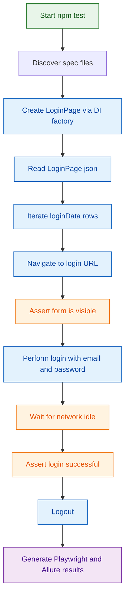

# Playwright Automation Framework

Scalable UI automation framework using Playwright + TypeScript, with Inversify-based dependency injection and Allure reporting.

---

## ✨ Highlights

- Page Object Model (POM) separation: `pages` for actions, `pageObjects` for locators.
- Inversify DI for feature-level wiring (`homepage`, `loginpage`).
- JSON-driven test data (`src/resource/testdata/LoginPage.json`).
- Built-in HTML + Allure report generation.

---

## 🧰 Tech Stack

- Playwright `^1.58.2`
- TypeScript `^5.4.0`
- Inversify `^6.0.2`
- allure-playwright `^3.5.0`
- reflect-metadata `^0.2.2`

---

## 📁 Current Project Structure

> Note: folder name is currently `containters` in source and aliases (intentional here to match code).

```text
Playwright_Framework/
├── src/
│   ├── config/
│   │   └── playwright.config.ts
│   ├── containters/
│   │   ├── homepage/
│   │   │   ├── homepage.inversify.ts
│   │   │   └── Homepage.symbols.ts
│   │   └── loginpage/
│   │       ├── LoginPage.inversify.ts
│   │       └── LoginPage.symbol.ts
│   ├── interfaces/
│   │   ├── HomePage.ts
│   │   └── LoginPage.ts
│   ├── pageObjects/
│   │   ├── HomePageobj.ts
│   │   └── LoginPageObj.ts
│   ├── pages/
│   │   ├── homepage.ts
│   │   └── LoginPage.ts
│   ├── resource/
│   │   └── testdata/
│   │       └── LoginPage.json
│   └── tests/
│       ├── launchBrowser.spec.ts
│       └── loginpage.spec.ts
├── allure-results/
├── allure-report/
├── playwright-report/
├── playwright.config.ts
├── tsconfig.json
├── package.json
└── README.md
```

---

## 🏛️ Framework Design

### 1) Page Object Model (POM)

- `src/pageObjects/*`: locator-only classes (`getUsernameField()`, `getSubmitButton()`, etc.).
- `src/pages/*`: user/business actions (`login`, `logout`, `clickSignIn`).
- `src/tests/*`: test intent and assertions only.

### 2) Dependency Injection (Inversify)

The framework currently uses two valid DI styles:

- **Homepage flow**: container returns class, then test calls `.init(page)`.
- **Login flow**: container returns a **factory** `(page) => new LoginPage(page)`.

This keeps Playwright `Page` lifecycle inside tests while still using DI for class wiring.

### 3) Data-Driven Testing

- Login suite reads test data from `src/resource/testdata/LoginPage.json`.
- Each entry in `loginData` becomes a test case with dynamic title:
    `TC001, Valid login credentials`

---

## 📦 Setup

### Prerequisites

- Node.js 18+ recommended
- npm

### Installation

```bash
npm install
npx playwright install
```

---

## ▶️ Run Commands

From `package.json`:

- `npm test` → run tests + generate Allure report
- `npm run test:headed` → headed run + generate Allure report
- `npm run debug` or `npm run test:debug` → debug mode
- `npm run allure:report` → generate report from `allure-results`
- `npm run allure:open` → open generated Allure report
- `npm run test:allure` → run + generate + open Allure

---

## ⚙️ Configuration Snapshot

### Playwright (`playwright.config.ts`)

- `testDir: './src/tests'`
- `workers: 1`
- `fullyParallel: false`
- `headless: false`
- `trace: 'retain-on-failure'`
- reporters: `html`, `allure-playwright`
- project: `chromium`

### TypeScript Aliases (`tsconfig.json`)

- `@pages/*` → `src/pages/*`
- `@pageObjects/*` → `src/pageObjects/*`
- `@interfaces/*` → `src/interfaces/*`
- `@symbols/*` → `src/containters/*`
- `@config/*` → `src/config/*`

---

## 🧪 Login Test Flow (Neat Visual)



---

## 🔄 Step-by-Step Execution Flow

1. `npm test` runs `npx playwright test`.
2. Playwright loads config and starts Chromium.
3. Test data is loaded from `LoginPage.json`.
4. `beforeEach` resolves page classes from Inversify containers.
5. Tests execute page actions through `pages/*` methods.
6. Assertions validate outcomes.
7. Results are written to `playwright-report/` and `allure-results/`.
8. Allure HTML report is generated to `allure-report/`.

---

## 📊 Test Data Format

Current JSON format used by login tests:

```json
{
    "loginData": [
        {
            "testId": "TC001",
            "description": "Valid login credentials",
            "email": "vijaydurairaj@mail.com",
            "password": "P@ssword@1"
        }
    ],
    "urls": [
        {
            "login": "https://rahulshettyacademy.com/client"
        }
    ]
}
```

---

## 🛠️ Troubleshooting

### Alias / import issues

- Ensure the import uses existing aliases from `tsconfig.json`.
- Current alias for container symbols is `@symbols/* -> src/containters/*`.

### Playwright browser issues

```bash
npx playwright install
```

### Allure report issues

```bash
npm run allure:report
npm run allure:open
```

---

## 📚 References

- https://playwright.dev/
- https://www.typescriptlang.org/docs/
- https://inversify.io/
- https://allurereport.org/

---

## 🗓️ Last Updated

March 2, 2026
