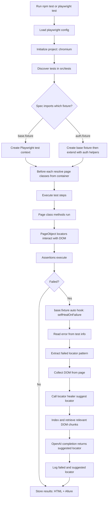
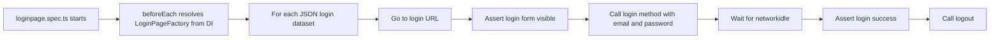

# Playwright Automation Framework

Scalable Playwright + TypeScript framework with layered fixtures, Inversify-based dependency wiring, data-driven scenarios, API interception, and AI-based locator suggestion on failures.

## What This Framework Does

- Runs UI and API-aware Playwright tests from `src/tests`.
- Uses fixture layering (`base` -> `auth`) for reusable setup and utilities.
- Resolves page/service dependencies through Inversify containers.
- Keeps selectors in page object classes and business actions in page classes.
- On test failure, captures DOM and asks an AI service to suggest a stronger locator.
- Produces Playwright HTML report + Allure results.

## Tech Stack

- Playwright
- TypeScript
- Inversify
- OpenAI SDK
- Allure Playwright reporter
- ESLint

## Project Structure

```text
Playwright_Framework/
├── src/
│   ├── containers/              # Inversify containers + symbols
│   ├── interfaces/              # Contracts for pages/services
│   ├── models/                  # Shared models
│   ├── pageObjects/             # Locators only
│   ├── pages/                   # Business actions/workflows
│   ├── resource/                # Test and API payload data (JSON)
│   ├── services/                # Implementations (e.g., LocatorHealer)
│   ├── tests/
│   │   ├── fixtures/            # base.fixture.ts, auth.fixture.ts
│   │   ├── launchBrowser.spec.ts
│   │   ├── loginpage.spec.ts
│   │   └── productlistingpage.spec.ts
│   └── utils/                   # Helpers (e.g., domCollector.ts)
├── playwright.config.ts
├── ARCHITECTURE.md
├── tsconfig.json
├── eslint.config.cjs
├── package.json
└── README.md
```

## Detailed Framework Flowchart



## Execution Flow By Layer

### 1. Playwright Runtime Layer

- `playwright.config.ts` sets:
    - `testDir: ./src/tests`
    - `fullyParallel: false`
    - `workers: 1`
    - reporters: `html`, `allure-playwright`
    - trace: `retain-on-failure`
- Current browser project enabled: `chromium`.

### 2. Fixture Layer

- `src/tests/fixtures/base.fixture.ts`
    - Extends Playwright `test`.
    - Auto-runs `selfHealOnFailure` fixture.
    - On failure, it:
        - reads first error message from `testInfo`.
        - extracts failed locator (`locator(...)`, `selector:`, or Playwright locator API call).
        - collects DOM via `getDOM(page)`.
        - calls AI service `suggestLocator(...)`.
        - logs failed locator and suggested locator.

- `src/tests/fixtures/auth.fixture.ts`
    - Extends `base.fixture.ts`.
    - Adds:
        - `loginAs(email, password)` UI login helper.
        - `getToken(email, password)` API login helper.

### 3. DI Container Layer

- `src/containers/loginpage/LoginPage.inversify.ts`
    - Binds `LoginPageFactory` to create `new LoginPage(page)`.
- `src/containers/homepage/homepage.inversify.ts`
    - Binds `HomePage` class to interface symbol.
- `src/containers/ai/inversify.config.ts`
    - Binds `ILocatorHealer` -> `LocatorHealer`.

This enables specs/fixtures to request page/service instances without hardcoding constructors everywhere.

### 4. Page and PageObject Layer

- Page classes in `src/pages` contain user actions (login, logout, product logic).
- Page object classes in `src/pageObjects` contain selectors and locator getters.
- Pattern:
    - spec calls page method.
    - page method calls pageObject getter.
    - locator performs action/assertion.

### 5. Data Layer

- JSON test data from `src/resource/testdata` drives login scenarios.
- API endpoint data from `src/resource/api_testdata` drives product-list interception.

### 6. Service Layer (AI Locator Suggestion)

`src/services/LocatorHealer.ts` flow:

1. Validate `OPENAI_API_KEY`.
2. Chunk trimmed DOM into overlapping segments.
3. Generate embeddings for each chunk.
4. Embed failed locator query.
5. Compute cosine similarity and select top chunks.
6. Build prompt with retrieved DOM context.
7. Request chat completion.
8. Return locator suggestion string.

## Test-Suite Flowcharts

### Login Suite Flow



### Product Listing Suite Flow

```mermaid
flowchart LR
        A[productlistingpage.spec.ts starts] --> B[Build endpoint pattern from api_testdata]
    B --> C[Register route to intercept products API]
    C --> D[Start response wait predicate]
        D --> E[Call auth fixture loginAs]
        E --> F[Capture products response JSON in route handler]
        F --> G[Await products response promise]
        G --> H[Extract data array]
        H --> I[Assert products length > 0]
```



## API Interception Pattern Used

In `productlistingpage.spec.ts`, interception is done before login to avoid timing race:

1. Register route (`page.route(...)`) for product endpoint pattern.
2. Use `route.fetch()` to get original response.
3. Store parsed JSON in test variable.
4. Call `route.fulfill({ response })` so app behavior remains unchanged.
5. Wait explicitly with `page.waitForResponse(...)`.
6. Assert on captured API data.

## Commands

- `npm test`: Run tests, then generate Allure report.
- `npm run test:headed`: Run headed tests, then generate Allure report.
- `npm run debug` or `npm run test:debug`: Run in debug mode.
- `npm run lint`: Lint TypeScript files under `src`.
- `npm run lint:fix`: Auto-fix lint issues.
- `npm run allure:report`: Generate report from `allure-results`.
- `npm run allure:open`: Open generated Allure report.
- `npm run test:allure`: Run test + generate + open report.

## Setup

Prerequisites:

- Node.js 18+
- npm

Install:

```bash
npm install
npx playwright install
```

## Environment Variable

Create `.env` in project root:

```env
OPENAI_API_KEY=your_openai_api_key
```

Without this key, AI locator suggestion in failure hook will throw an error when invoked.

## Import Rules

Use alias imports (`@containers/*`, `@pages/*`, `@interfaces/*`, `@utils/*`) or relative imports.

Avoid `src/...` absolute imports (lint-enforced).

## Additional Docs

- See `ARCHITECTURE.md` for concise component responsibilities.
- Standalone diagram page: [docs/framework-flowchart.md](docs/framework-flowchart.md)
- Mermaid source file: [docs/framework-flowchart.mmd](docs/framework-flowchart.mmd)
